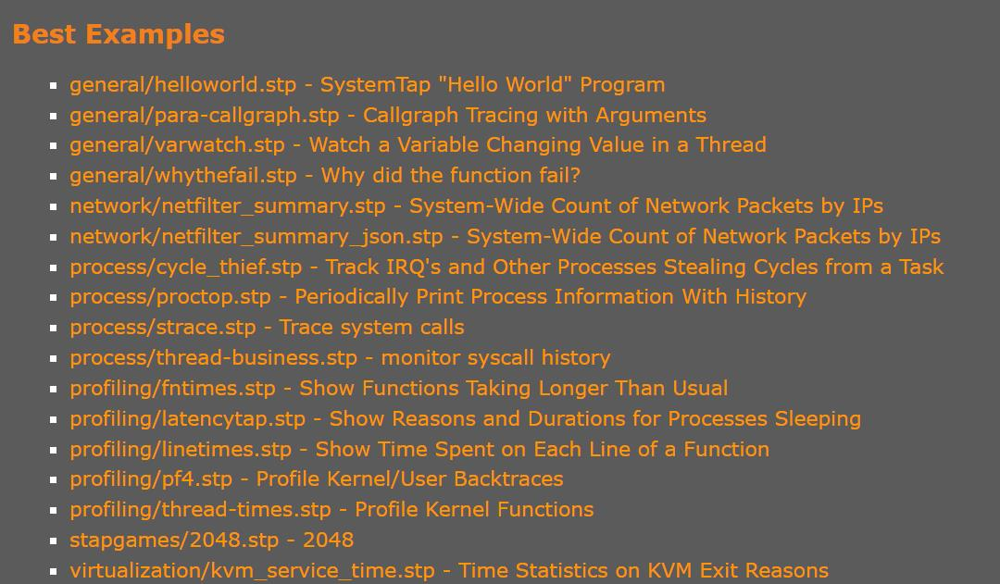

# systemtap-examples
对于systemtap自带的示例，进行注释学习。

## Best Example

根据文档中的说明，对于最佳示例从语法、运行过程等方面进行分析。

根据文档说明，最佳示例如下：

对于上面的示例进行分析和注释。

## general/varwatch.stp - Watch a Variable Changing Value in a Thread

该脚本放置了一组探测器（由 $1 指定），每个探测器监视某个上下文 $variable 表达式（由 $2 指定）的状态。每当值发生变化时，就会跟踪活动线程的事件。

